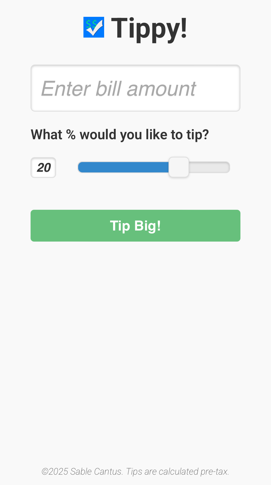
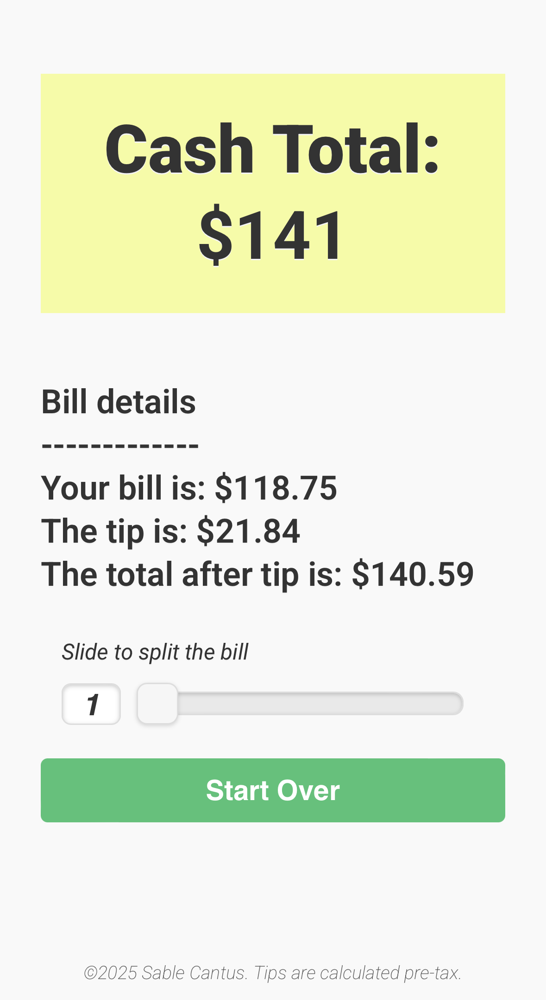
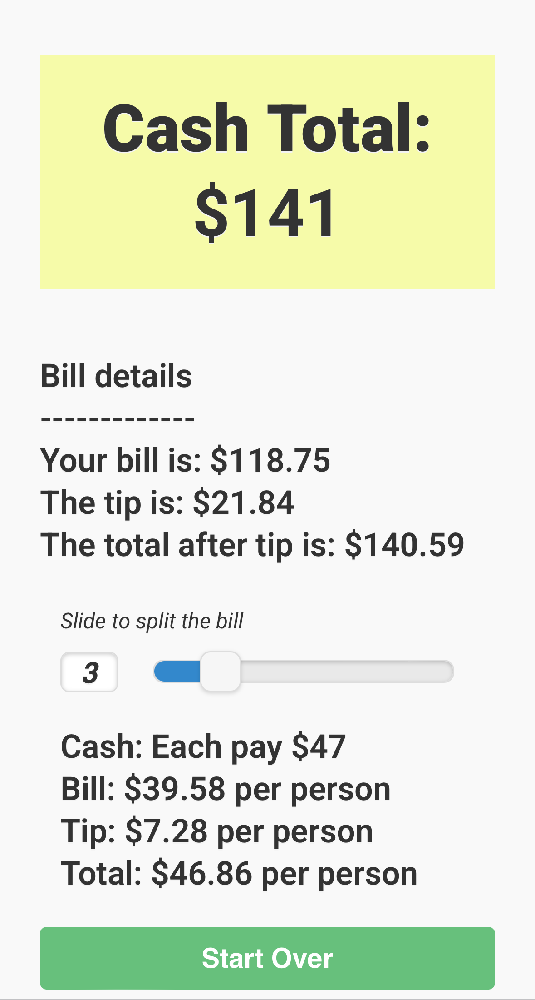

Tippy
=====

## Give Good Tips with Tippy!

Tippy is an html5 and javascript tip generator. Enter the bill amount and hit the **Tip Big** button. Use the slider to split the bill.

Save this application to your home screen for easy access.

## [🚀 View this in your browser](http://sc137.github.io/tippy/)

--

You can adjust the tax rate for your county / city. Los Angeles is 9% but 9.5% in some places.

    var tax = 1.08

The [App Icon Template](http://appicontemplate.com/ios8) is rad.

